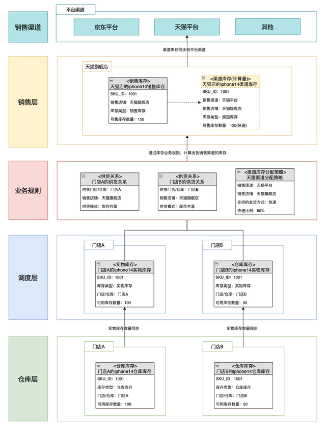

# Zhul【烛龙】中央库存系统

## 一、背景介绍

### 1.1.中央库存系统是什么？

> 中央库存系统(Center Inventory System，CIS)，是将自营库存、仓库库存、门店库存、商家库存等进行集中监控、管理和调度，并为外围系统提供统一库存服务的系统，它是位于仓储管理系统、门店系统、商家系统等之上，销售渠道平台之下的库存集中管理系统。

### 1.2.中央库存系统解决了什么？

> 在新零售全渠道模式下，库存管理面临着诸多挑战：
>
> - 各渠道库存割裂，进行线上线下促销活动时，商品超卖，引起客诉
> - 各渠道库存分配不合理，缺少统一监控、统一调度，出现部分地区严重缺货，库存积压
> - 各渠道库存数据同步不及时，有货却不能下单，销售机会大量流失
> - 各地库存数据分散在各系统中，数据不通，无法知晓库存分布情况，无法统一采购/调拨
> - 无法根据用户的下单信息，进行智能分仓、就近发货

### 1.3.中央库存系统定位是什么？

> 向上打通所有销售渠道平台，实现全渠道库存共享、自动化运营
>
>
>
> 向下对接各地仓库/门店库存，将各地库存放在一个池子里，进行统一管理、统一监控、统一调配
>
>
>
> 核心思想：承上启下(向上实现共享，向下统一管理)

## 二、设计原则

### 2.1.新零售三层库存模型

### 2.2.实物库存与销售库存

### 2.3.三层库存设计维度

- 平台销售库存维度

> 平台销售库存主要处理与销售相关的逻辑，关注点主要是SKU的可销售库存数量，至于商品到底在哪些仓库里，并不需要关注。一个通用的平台销售库存维度主要为SKU、可销售库存。
>
>
>
> 开启虚拟库存 -> 可销售库存=虚拟库存-预占库存-预留库存
>
> 未开启虚拟库存 -> 可销售库存=实物库存-预占库存-预留库存

- 仓库/门店库存维度

> 仓库和门店系统仅需要关注当前仓库和门店的实物流转情况。
>
>
>
> 仓库/门店库存维度主要：仓库、SKU、批次、货位、库存状态、实物库存数量、已分配库存数量、冻结库存数量

- 中央库存维度

> 中央库存是平台销售库存和仓库实物库存之间的纽带，所以会有实物库存维度和可销售库存两个维度。
>
>
>
> 实物库存维度：主要统计每个仓库和门店的实物库存，但不需要像仓库一样精细到批次和货位维度，只需要统计到每个仓库和门店的实物总数维度即可。
>
>
>
> 可销售库存维度：根据实物库存重新计算可为销售平台提供的实物库存数量。

## 三、设计思路

### 3.1.功能设计

### 3.2.分层设计

### 3.3.模型设计

| **实物库存属性说明**                                         |                                                              |                  |
| ------------------------------------------------------------ | ------------------------------------------------------------ | ---------------- |
| **属性**                                                     | **说明**                                                     | **举例**         |
| 仓库/门店                                                    | 仓库和门店同属于管理现库存的载体                             | 上海仓、海淀一店 |
| SKU编号                                                      | SKU 编号                                                     | SKU ID:110976890 |
| 库存状态                                                     | 合格/不合格                                                  | 合格             |
| 实物库存                                                     | 仓库内的实际库存                                             | 2000             |
| 预占库存                                                     | 发货之前对库存进行预占，避免超卖 应用场景：正常订单、退供单、调拨单下单后，为避免其他出库单抢库存，将指定仓库/门店的库存预占 | 200              |
| 冻结库存                                                     | 商品尚在仓库中，需临时锁定的库存。例如，盘点临时锁定/临期锁定/商品借出/盘点差异/其他原因 应用场景：一般由仓库主动发起锁定，是用来标记库存的异常情况(*设计时要支持每一个商品的预占库存数量和冻结库存数量都能够找到其对应产生的业务单据，如当前冻结库存数量为5，系统应该能够体现出来是哪些业务操作产生的) | 500              |
| 在途库存                                                     | 管理在途中的库存，记录调拨未入库、采购未到货的库存，避免重复采购 | 100              |
| 是否全部冻结                                                 | 特殊情况下，需要在中央库存系统中将某仓库的所有库存都冻结，已冻结的库存明细，不作为可用库存 | 否               |
| 补充说明：是否全部冻结在某些门店中，如果商品库存需要在店内正常操作进销存业务，但不希望作为平台的可用库存，便可以使用此字段进行标记，它与【冻结库存】最大的区别是【冻结库存】只能锁定商品的部分库存，而【全部冻结】可以将该门店的此商品库存全部冻结可用库存可用库存=实物库存-预占库存-冻结库存 |                                                              |                  |

| **销售库存属性说明**    |                                                              |                  |
| -------------------- | ------------------------------------------------------------ | ---------------- |
| **属性**              | **说明**                                                     | **举例**         |
| 销售渠道               | 不同销售平台对应不同销售渠道                                 | 天猫、京东       |
| 销售店铺               | 与多渠道多平台的售卖店铺保持一致，每个店铺按照比例分配一定库存 | 销售一店         |
| SKU编号               | SKU 编号                                                     | SKU ID:110976890 |
| 可销售库存             | 根据业务策略计算商品在各平台上的可售库存。根据业务维度可分为配送库存、自提库存等 | 100              |

| **供货关系属性说明**    |                                                              |                  |
| -------------------- | ------------------------------------------------------------ | ---------------- |
| **属性**              | **说明**                                                     | **举例**         |
| 供货仓库/门店          | 仓库和门店同属于管理现库存的载体                                   | 上海仓、海淀一店 |
| 销售店铺              | 与多渠道多平台的售卖店铺保持一致，每个店铺按照比例分配一定库存           | 销售一店         |
| 供货模式              | 供货模式分为两种：共享、独占                                       | 共享             |

## 四、架构设计

### 4.1.业务架构

### 4.2.应用架构

### 4.3.功能逻辑

#### 4.3.1.调度层同步逻辑

#### 4.3.2.销售库存计算逻辑

##### 多仓供货场景

> 门店A、门店B为两个线下门店，门店A有100件iphone14，门店B有50件iphone14。  假设商家有1个天猫旗舰店，门店A、门店B均给天猫店供货。  天猫旗舰店仅支持快递发货方式，为了防止超卖，设置快递的最大分配比例为80%。  如图例所示，最终天猫渠道的iphone14的库存数量为120，并定期将数量同步到天猫平台。

##### **单仓给多店供货场景**

> 商家有1个电商仓，为商家的各个电商平台店铺提供仓储服务与发货服务，电商仓有100件iphone14。  电商仓同时为京东旗舰店、天猫旗舰店供货，两个店铺仅支持快递发货方式，最大分配比例分别为80%、60%。  如图例所示，最终京东渠道的iphone14的库存数量为80，天猫渠道的iphone14的库存数量为60。

##### **门店全渠道库存共享场景**

> 随着新零售线上线下渠道加速融合，门店线上线下全渠道销售，已经成为大部分零售商家的标配。  受益于微信生态和小程序电商的高速发展，越来越多的门店开启了云店模式，云店实际上就是门店的线上化交易渠道，或者称为门店的“线上货架”。  连锁企业把线下门店嫁接到微信生态中，将门店所有商品上架到云店小程序。借助云店，消费者无需到店，即可享受到门店的服务，同时，门店的导购可以向自己的会员推荐所有云店商品。  如图例所示，门店A有100份的草莓蛋糕，门店A为自己供货，并共享草莓蛋糕的库存到多个销售渠道（美团外卖、云店、门店线下渠道），实现门店“一盘货”全渠道销售。

#### 4.3.3.渠道库存同步

> 销售库存计算完后，需要将渠道库存同步到各个平台渠道，这样，消费者才能完成交易流程。根据渠道类型不同，渠道库存同步有两种处理逻辑：
>
> - 自营系统：如果自营渠道与库存系统是一体的，即一套系统，那么不需要过于复杂的库存同步逻辑，自营渠道直接读取中央库存系统的渠道库存即可。
> - 三方平台系统：像天猫，京东，美团，饿了么等，这些三方平台系统属于外部系统，商家自身无法管控，就需要通过开发API，向三方平台同步渠道库存。一般而言不会实时同步渠道库存，即只要有库存变动，就计算渠道库存，同步至三方平台。这种方式对系统压力较大，而且三方平台的API大多会按调用量收费，因此，会设定好时间间隔，定期同步渠道库存，例如5分钟一次。

#### 4.3.4.组合商品计算逻辑

> 组合商品一般指人为将几个单独售卖的商品组合在一起，进行合并售卖的商品，例如：下午茶套餐、七夕美妆组合等。  组合商品会先在调度层，根据组合比例计算好虚拟库存，不影响子商品的供货逻辑，下单时，会根据组合商品标识，进行子商品的实物库存预占、扣减。  如图所示，电商仓中，商品A有150件，商品B有200件，根据组合关系，可以算出组合商品C有100件。当下一单商品C时，会预占1件商品A+2件商品B的实物库存。

## 五、小结

> 电商库存管理的核心在于要对库存数据进行分层设计：根据实际业务需要针对仓库层库存、实物层库存、销售层库存分别进行不同颗粒度的管理。但在基础库存数据模型建立起来以后，能对业务带来更多价值的，还是在于怎样进行供应链管理：如何用最小的成本(低库转)以最快的速度(库存在各仓的分布合理，不缺货)将用户需要的商品送到他手上。而这就是如何做采购计划和采购执行、如何做仓与仓之间的库存平衡等更为复杂的课题了。

参考链接:

[严选库存中心设计](https://mp.weixin.qq.com/s?__biz=MzIxMzEzMjM5NQ==&mid=2651065450&idx=1&sn=eb7b53162e813f67ba694c167a115821&chksm=8c4bd96ebb3c507800f1bd336307b9d45aec08918925465170ba3ffafff62dd6331a2d22b20f&scene=27#wechat_redirect)

[电商库存详解](https://zhuanlan.zhihu.com/p/26416921)

[库存系列](https://www.woshipm.com/u/676582/page/2)

[中央库存系统架构设计](http://www.weiot.net/article-365142-1.html)